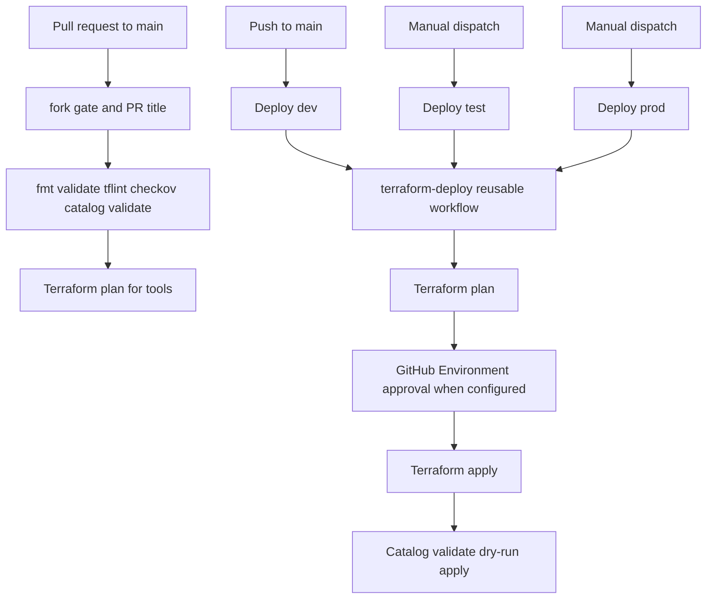

# CI/CD Guide

## Workflow Map



## Workflows

| Workflow | Trigger | Environment | Apply |
| --- | --- | --- | --- |
| `ci.yml` | Pull request to `main` | `tools` | No |
| `cd-dev.yml` | Push to `main` or manual dispatch | `dev` | Yes |
| `cd-test.yml` | Manual dispatch | `test` | Yes |
| `cd-prod.yml` | Manual dispatch | `prod` | Yes |
| `terraform-deploy.yml` | Reusable workflow | Input-selected | Input-selected |

Markdown-only changes are ignored by the current CI/CD path filters. There is no
separate documentation link or Markdown quality job in the current workflows.

## Required GitHub Environment Variables

The reusable workflow maps these variables to Terraform:

| GitHub Variable | Terraform use |
| --- | --- |
| `AZURE_CLIENT_ID` | OIDC client identity |
| `AZURE_TENANT_ID` | Azure tenant |
| `AZURE_SUBSCRIPTION_ID` | Subscription |
| `BACKEND_RESOURCE_GROUP` | Terraform state resource group |
| `BACKEND_STORAGE_ACCOUNT` | Terraform state storage account |
| `TF_RESOURCE_GROUP` | Workload resource group |
| `TF_VNET_NAME` | Spoke VNet |
| `TF_VNET_RESOURCE_GROUP` | Locked networking resource group |
| `TF_ACA_SUBNET_CIDR` | ACA subnet CIDR |
| `TF_PE_SUBNET` | Private-endpoint subnet name |
| `TF_ACR_NAME` | ACR name |
| `TF_KEY_VAULT_NAME` | Key Vault name |
| `TF_POSTGRES_SERVER` | PostgreSQL server name |
| `TF_GS_CLOUD_VERSION` | GeoServer Cloud image tag |

The workflow comments list additional optional variables, but the current visible
workflow `env` block does not map them. Do not assume an optional variable has an
effect until its `TF_VAR_*` mapping is verified in the workflow.

## Authentication and Permissions

- GitHub Actions uses Azure OIDC. It does not use a client secret.
- The reusable workflow has a deny-all permission baseline.
- Static checks need repository read access.
- Plan and apply need `id-token: write` for Azure login.
- Apply is gated by the target GitHub Environment when required reviewers are
  configured.
- Fork pull requests are rejected before cloud-authenticated jobs run.

The federated credential subject must match the workflow environment, for
example:

```text
repo:<org>/<repo>:environment:dev
```

The pull-request `tools` plan needs a federated credential and GitHub variable
arrangement that permits the selected subject. Confirm that in Azure before
troubleshooting Terraform authentication.

## Terraform Plan and Apply

The reusable workflow:

1. Installs pinned tools from `mise.toml`.
2. Runs Terraform format and offline validation.
3. Runs TFLint and Checkov.
4. Validates the catalog offline.
5. Logs in to Azure with OIDC.
6. Runs `tf.sh <env> plan` and saves `infra/stack/tfplan`.
7. Runs `tf.sh <env> apply` with the saved plan.
8. Installs `geo-server-app-config`.
9. Runs catalog dry-run and apply.

The saved plan artifact has a one-day retention because it may contain sensitive
planned values. If it expires, create a new plan instead of applying an unrelated
plan file.

## State Isolation

State is selected at Terraform init time:

```text
TFSTATE_RESOURCE_GROUP
TFSTATE_STORAGE_ACCOUNT
TFSTATE_CONTAINER   # default tfstate
TFSTATE_KEY         # default geoserver-cloud/<env>.tfstate
```

The state backend uses Azure AD authentication. A state lock prevents concurrent
Terraform operations for the same backend key. Do not share a state key between
environments.

## Deployment Approval

Configure required reviewers on `test` and `prod` GitHub Environments. The
workflow file shows the intended gate, but the actual reviewer list is stored in
GitHub repository settings and must be verified separately.

## Failure Handling

- Static check failure: fix the reported code or catalog validation error and
  rerun the pull request.
- Plan failure: inspect Azure OIDC, backend variables, private DNS, and required
  GitHub Variables.
- Apply failure: inspect the failed Azure resource and Terraform state; do not
  delete the state blob as a first response.
- Catalog failure: check Gateway, ACL, Key Vault, and the resource-specific
  response. The catalog apply is not transactional.
- Expired plan artifact: rerun the plan job.

## Integration Tests

The `integration-tests/` suite is not currently called by CI/CD. Run it manually
against a deployed environment as described in
[integration-tests/README.md](../integration-tests/README.md).
