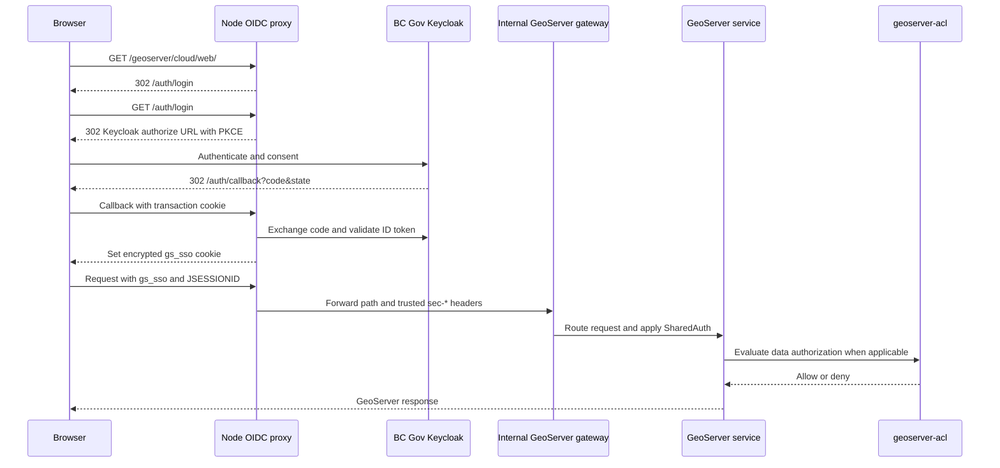

# Security and Identity

This document describes the active authentication and authorization model for
GeoServer Cloud on Azure Container Apps.

## Security Layers

| Layer | Component | Responsibility |
| --- | --- | --- |
| Identity provider | BC Gov Keycloak | Authenticates an interactive user and issues OIDC tokens. |
| Public edge | `node-oidc-proxy` on Azure App Service | Runs OIDC login, validates the session, refreshes tokens, protects browser redirects, and removes spoofed identity headers. |
| Gateway | GeoServer Cloud gateway | Routes the public base path to internal GeoServer services and applies the configured gateway security filter. |
| GeoServer authentication | `headerAuth`, Basic auth, `authKey` | Builds a GeoServer security context from trusted headers or GeoServer-native credentials. |
| Data authorization | `geoserver-acl` | Applies workspace, layer, service, request, role, and username rules. |
| Secret store | Azure Key Vault | Stores OIDC, database, admin, registry, RabbitMQ, ACL, and machine-client secrets. |
| Network boundary | ACA internal load balancer and VNet integration | Keeps the GeoServer gateway reachable only through the VNet path. |

## Interactive User Flow



## OIDC Principal and Claims

The deployed Terraform configuration sets:

- `USERNAME_CLAIM=email`
- `USERNAME_LOWERCASE=true`
- `USER_GUID_CLAIM=idir_user_guid`
- `DISPLAY_NAME_CLAIM=display_name`

Therefore:

- `email` becomes the lower-case GeoServer principal in `sec-username`.
- `idir_user_guid` is retained for audit and the IDIR reference page. It is not
  the active GeoServer principal in the current deployment.
- `display_name` is optional and is used for UI presentation.
- `sec-roles` is set from `OIDC_ROLES`. The current value is
  `ROLE_ADMINISTRATOR` for every authenticated OIDC session.

Changing the principal claim is an identity migration. It requires changes to
GeoServer users, roles, ACL rules, tests, and any catalog entries that use a
username.

## Header Contract

The proxy always removes inbound headers with these prefixes before forwarding:

```text
sec-
x-gsc-
```

For an authenticated OIDC session, it then adds the configured identity,
display-name, and role headers. A client cannot choose its own GeoServer
principal by sending `sec-username` or `sec-roles` to the public proxy.

GeoServer is configured by
[configure-geoserver-security.sh](../infra/scripts/configure-geoserver-security.sh)
with:

- `principalHeaderAttribute=sec-username`
- `rolesHeaderAttribute=sec-roles`
- `roleSource=Header`
- `headerAuth` in the `web`, `default`, `gwc`, and `rest` chains

The script uses the built-in XML role and user/group services. The JDBC security
service is not the active service for this deployment.

## Machine Clients

Machine clients do not use the browser OIDC flow. When
`MACHINE_AUTH_PASSTHROUGH=true`, the proxy forwards requests that contain:

- `Authorization: Basic ...`
- `?authkey=...`

The proxy does not validate those credentials. GeoServer performs the
authentication.

The `authKey` filter is wired only to the `default` OWS chain and `gwc` chain.
It is not wired to `web` or `rest`. This means:

- WMS, WFS, WCS, WPS, and tile requests can use `authkey`.
- The GeoServer Web UI cannot use `authkey`.
- GeoServer REST configuration cannot use `authkey`.
- A machine client that needs REST configuration must use Basic auth for a real
  GeoServer user or an authenticated OIDC session.

Authentication and authorization are separate:

1. Terraform and `configure-geoserver-security.sh` create the GeoServer user and
   Key Vault key.
2. `geo-server-app-config/catalog/acl_rules.yaml` grants access to the exact
   username, workspace, layer, service, and request.

Removing an ACL rule does not remove the user or key. Removing a Terraform
username does not remove the existing GeoServer user. Follow the three-place
cleanup in [catalog-reference.md](catalog-reference.md#machine-client-lifecycle).

## Trust Boundary

The intended request path is:

```text
Internet
  -> App Service node-oidc-proxy
  -> VNet integration
  -> ACA internal load balancer gateway
  -> internal GeoServer Cloud services
```

Only the gateway is exposed on the ACA environment's internal load balancer.
The OWS services, REST service, Web UI, GWC, and ACL service use internal
service-to-service ingress.

The proxy removes spoofable identity headers. A caller that reaches the gateway
through another VNet path is outside this protection. Network access to the
internal load balancer must therefore be treated as a privileged path and
verified during deployment. Do not assume that the word `external` on the ACA
gateway means public internet access; the environment itself has an internal
load balancer.

The gateway configuration applies `SharedAuth` to the OWS, REST, GWC, and Web UI
routes. The exact filter implementation is supplied by the GeoServer Cloud
gateway image. Validate the effective filter behavior after an image upgrade.

## Session Cookies

The proxy uses an encrypted `gs_sso` cookie. GeoServer uses `JSESSIONID` for the
stateful Wicket Web UI. Both cookies can be present:

- `gs_sso` proves the browser session to the proxy and carries refresh data.
- `JSESSIONID` keeps the GeoServer Web UI page state and replica affinity.

The proxy warns when the sealed session cookie reaches about 3800 bytes. A
browser may silently drop a cookie near the 4 KB limit. Check for the
`session:seal-large` log event when a login appears not to persist.

A refresh is attempted when the access token has 30 seconds or less remaining.
If refresh fails, the proxy clears `gs_sso`, does not retry the request, and
applies the unauthenticated decision matrix.

## Keycloak Client Checklist

Register the client with:

- Valid redirect URI: `https://<proxy-host>/auth/callback`
- Valid post-logout redirect URI: `https://<proxy-host>/`
- Web origin: `https://<proxy-host>`
- Scope: `openid profile email`
- ID-token claim: `email`
- Optional ID-token claims: `idir_user_guid`, `display_name`

When login fails, inspect the proxy events:

- `oidc:discovery`
- `oidc:callback-claims`
- `oidc:principal-claim-missing`
- `auth:callback-error`

Never enable `DEBUG_UNSAFE_HEADERS` in a shared or production environment. It
can write cookies, Basic credentials, and other sensitive header values to logs.

## Native GeoServer OIDC Decision

GeoServer has an OIDC extension. This project uses the Node proxy instead because
it provides the public edge behavior that is not part of GeoServer's catalog
security configuration:

- Keycloak callback and redirect handling
- PKCE, state, and nonce handling
- Encrypted browser session and token refresh
- Browser redirect versus API `401` behavior
- Header anti-spoofing
- One public base path for the GeoServer Cloud gateway
- Machine-client passthrough
- A replaceable edge boundary for a future Azure Front Door deployment

A native GeoServer OIDC replacement is possible only after testing the exact
pinned GeoServer Cloud images. The test must cover the Web UI, REST, all OWS
services, multiple replicas, cookies, roles, machine clients, and direct gateway
access. It must preserve the `geoserver-acl` authorization model and the VNet
boundary.

## Security Verification

Use the integration tests and manual checks in
[operations-guide.md](operations-guide.md#post-deployment-validation):

- Unauthenticated browser requests redirect to `/auth/login`.
- Unauthenticated API requests receive `401`.
- Invalid Basic credentials do not grant access.
- Anonymous OWS requests cannot see protected layers.
- Authenticated OWS requests return data.
- Machine authkey access works only on the configured OWS/GWC chains.
- Authkey requests do not authenticate REST configuration.
- Client-supplied `sec-*` headers never become the GeoServer principal.
