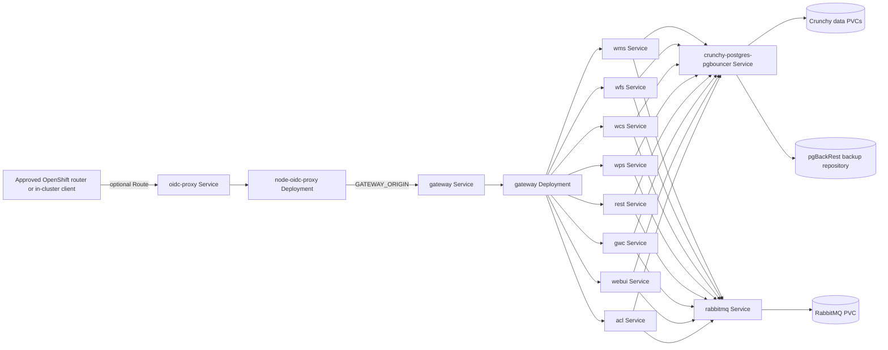

## Context

The current deployment target is Azure Container Apps. `infra/stack/` creates the
Container Apps environment, imports the GeoServer Cloud images into Azure Container
Registry, provisions PostgreSQL Flexible Server with PostGIS, creates RabbitMQ, and
connects application secrets to Azure Key Vault. The GeoServer Cloud services use
Spring Boot configuration from `infra/deployment-config/`, communicate through
internal service names, and expose only the authenticated Node OIDC proxy at the
OpenShift edge. The gateway remains an internal Service for the proxy to call.

This change adds a second deployment path under `infra/helm/`. The
`crunchy-postgres` release owns the operator-managed PostgreSQL/PostGIS cluster;
the `geoserver-cloud` release owns the application workloads. The application
release receives the Crunchy release name and derives the pgBouncer Service and
generated user Secret names. Both releases run in an operator-selected namespace
without changing Azure resources or Terraform state. Namespace creation, quota, storage
class selection, Artifactory service-account or cluster-wide pull-secret setup,
network policy, Vault integration, and GitOps onboarding remain platform or
operator responsibilities.

The pinned GeoServer Cloud images and their configuration are the behavioral source
for both targets. The chart will translate the ACA service topology to Kubernetes
Service DNS names such as `wms:8080` and `acl:8080`; it will not introduce a second
catalog or authorization implementation. The existing Spring actuator configuration
enables health probes, so the chart will use configurable actuator probe paths and
verify the paths against the deployed image during validation.

All container images will be referenced through the BC Gov Platform Artifactory
endpoint `artifacts.developer.gov.bc.ca`. Docker Hub-origin images will use the
approved Artifactory remote repository path. Crunchy Postgres images will use the
BC Gov `bcgov-docker-local` repository path documented by the Crunchy Postgres
project. No rendered workload may contain a direct `docker.io` reference.

### Resource ownership

No Terraform module owns an OpenShift resource. `infra/modules/*` and
`infra/stack/` remain unchanged. The following ownership applies inside the Helm
chart:

| Resource | Helm owner | Purpose |
| --- | --- | --- |
| GeoServer Cloud Deployments | `templates/deployment-services.yaml` | gateway, webui, WMS, WFS, WCS, WPS, REST, and GWC |
| ACL Deployment | `templates/deployment-services.yaml` | GeoServer ACL authorization service |
| OIDC proxy Deployment | `templates/deployment-proxy.yaml` | OIDC login, session validation, trusted identity headers, and reverse proxying |
| Service objects | `templates/service.yaml` | Stable in-namespace DNS and ports |
| Spring configuration ConfigMap | `templates/configmap-config.yaml` | Deployment-time YAML and service targets |
| Crunchy Postgres chart | `infra/helm/crunchy-postgres/Chart.yaml` and values | HA PostgreSQL/PostGIS cluster, Patroni, pgBouncer, and pgBackRest |
| RabbitMQ StatefulSet | `templates/statefulset-rabbitmq.yaml` | GeoServer event bus with a per-pod PVC |
| Artifactory image-pull Secret | Platform-provided Secret reference | Pull all application and dependency images through Artifactory |
| Runtime application Secret | `templates/secret-runtime.yaml` | Create and preserve RabbitMQ, ACL, GeoServer admin, and proxy credentials |
| PodDisruptionBudgets | `templates/pdb.yaml` | Protect multi-replica workloads during voluntary disruption |
| HorizontalPodAutoscalers | `templates/hpa.yaml` | Scale stateless GeoServer and ACL Deployments |
| Proxy Route | `templates/route.yaml` | Optional approved edge exposure for the authenticated proxy only |

## Goals / Non-Goals

**Goals:**

- Deploy PostgreSQL/PostGIS with the Crunchy release and deploy the Node OIDC
  proxy, gateway, webui, WMS, WFS, WCS, WPS, REST, GWC, ACL, and RabbitMQ with
  the GeoServer release.
- Keep all image repositories, tags, resource settings, replica settings, storage
  sizes, service targets, probe paths, and proxy exposure configurable through
  validated chart values.
- Preserve the service behavior currently implemented by `infra/stack/` and the
  shared deployment configuration, including OIDC authentication, PostgreSQL
  catalog access, ACL access, RabbitMQ bus events, and gateway routing.
- Make the rendered resources compatible with the namespace's `restricted-v2`
  Security Context Constraint and with arbitrary OpenShift-assigned UIDs.
- Make stateful workloads restart-safe through Crunchy Postgres HA resources,
  RabbitMQ StatefulSets, volume claims, pgBackRest backups, bounded termination,
  and documented backup/restore prerequisites.
- Provide a repeatable operator workflow for linting, rendering, server-side dry
  runs, installation, smoke validation, upgrade, and rollback.

**Non-Goals:**

- Change Azure Container Apps Terraform modules, Terraform state, Azure Key Vault,
  Azure Container Registry, or Azure GitHub deployment workflows.
- Add GitHub Actions deployment jobs or a new CI/CD authentication mechanism.
- Create or administer OpenShift namespaces, quotas, storage classes, Routes,
  NetworkPolicies, registries, Vault/External Secrets integrations, GitOps systems,
  monitoring systems, or cluster-wide RBAC.
- Replace the Python catalog-as-code reconciler or change catalog and ACL rule
  requirements.
- Provide automatic PostgreSQL or RabbitMQ cross-zone failover in the first chart
  version. Production high availability and backup policy must be selected with the
  OpenShift platform owner before production use.

## Decisions

### Decision 1: Use two ordered Helm charts

The `crunchy-postgres` chart vendors the `bcgov/action-crunchy` templates at
commit `ab3db55f4d26e14f79fa89884f3ac2460109bd76` and renders the
operator-managed `PostgresCluster`. The `geoserver-cloud` chart owns the
stateless application workloads, RabbitMQ, and the schema-init Job. Operators
install the database release first, then pass its release name to the application
chart as `database.crunchyReleaseName`.

The vendored templates are reviewed in this repository and use the upstream
`crunchy.*` values contract. There is no runtime chart dependency or dependency
lock file to refresh. The database chart uses the Helm release as the cluster
name by default, so the application chart derives `<release>-pgbouncer` and
`<release>-pguser-postgres`; it does not declare or render the Crunchy templates.
Each chart is linted and rendered independently before promotion.

**Alternatives considered:**

1. Separate charts for every GeoServer service would allow independent releases,
  but would duplicate values and make a full-stack rollout harder to reproduce.
2. A hand-written PostgreSQL StatefulSet would reduce dependency management, but it
  would omit the BC Gov Crunchy HA, Patroni, pgBackRest, and PostGIS conventions
  requested for this platform.
3. A Terraform Kubernetes provider would preserve an infrastructure-as-code style,
   but it would introduce a second Terraform target and state lifecycle into a
   change explicitly requested as Helm-only.

### Decision 2: Translate the ACA topology to namespace-local Services

Each workload gets a ClusterIP Service named after the logical service. The gateway
configuration uses Kubernetes DNS targets:

| Target | Service URL |
| --- | --- |
| ACL | `http://acl:8080/acl/api` |
| WMS | `http://wms:8080` |
| WFS | `http://wfs:8080` |
| WCS | `http://wcs:8080` |
| WPS | `http://wps:8080` |
| REST | `http://rest:8080` |
| GWC | `http://gwc:8080` |
| Web UI | `http://webui:8080` |

The Node OIDC proxy is the only workload with an optional Route. The Route is
disabled by default so an install cannot accidentally create an externally
reachable edge. If an operator enables it, the chart creates one OpenShift
`Route` targeting the proxy Service and leaves TLS termination mode and hostname
configurable. The gateway has only an in-namespace ClusterIP Service. No
LoadBalancer or NodePort Service is rendered.

The database and broker are reachable only through their namespace-local Services.
GeoServer and ACL receive their connection settings through ConfigMap data and
Secret-backed environment variables. This retains the existing separation between
non-secret service topology and secret values.

**Alternatives considered:**

1. Reusing ACA `.internal.` hostnames is impossible across platforms and would
   couple the chart to Azure DNS.
2. Exposing the gateway directly would bypass the OIDC proxy authentication
  boundary, so the gateway remains internal and only the proxy may receive a
  Route.
3. Using a LoadBalancer or NodePort would require platform-level exposure that is
   outside this chart and is not needed for the gateway-first topology.

### Decision 3: Route all container images through Platform Artifactory

The parent chart will expose a global Artifactory registry value and a per-image
repository source and path. Docker Hub-origin GeoServer Cloud, ACL, and RabbitMQ
images will be referenced using the approved Artifactory remote repository path in the form
`artifacts.developer.gov.bc.ca/<remote-repository>/<image>:<immutable-tag>`.
The project-built Node OIDC proxy image will use the approved local repository in
the form `artifacts.developer.gov.bc.ca/bcgov-docker-local/node-oidc-proxy:<tag>`.
Crunchy Postgres, pgBackRest, pgBouncer, and related images will use the approved
`artifacts.developer.gov.bc.ca/bcgov-docker-local/<image>:<tag>` paths documented by
the BC Gov Crunchy Postgres project. Tags must be pinned and may be supplemented
with digests; `latest` is not allowed.

The charts will accept the name of the namespace pull Secret and add it to
`imagePullSecrets` on every application workload. The Crunchy chart will pass the
same value to dependency-supported resources; operator-created database pods may
also require the cluster-wide remote-cache Secret or an `ArtifactoryServiceAccount`
managed by Archeobot.
The chart documentation will describe both supported prerequisites, including the
generated `artifacts-*` Secret and the need to link it to service accounts as well
as explicitly reference it in workload specifications when a service account is
used. Gold DR secret synchronization remains an operator responsibility.

The chart will fail preflight validation when a rendered image starts with
`docker.io`, `registry-1.docker.io`, or another unapproved registry host.

**Alternatives considered:**

1. Direct Docker Hub references would bypass the platform cache and image supply
  chain, so they are prohibited.
2. Copying every image into a team-owned Artifactory repository would add a build
  and promotion process that is not required for Docker Hub remote caching.
3. Relying only on a cluster-wide pull Secret would make the chart less portable
  across supported namespaces, so the imagePullSecret remains an explicit value.

### Decision 4: Create and preserve one runtime application Secret

The chart will create one named runtime OpenShift Secret for RabbitMQ, GeoServer
admin, ACL, and proxy credentials. On first install, Helm generates random values;
the operator may provide `secrets.runtime.oidcClientSecret` through Helm
`--set-string` with a terminal environment variable. If no explicit value is
provided, Helm generates the OIDC client secret. On later upgrades, the template
uses `lookup` to preserve the existing values regardless of the fallback.
The Secret has a keep policy so application rollback or uninstall does not delete
credentials. The database Secret remains owned by Crunchy Postgres and the image
pull Secret remains platform-owned.

The chart will document the runtime Secret keys, the `--set-string` terminal
input, and the OIDC client registration step. It will fail at pod startup when a
required key is absent. Because Helm
stores rendered manifests in release metadata, operators must restrict access to
Helm release storage and use the platform-approved backup and rotation process.
The chart will not accept credential values through committed values files or
Helm `--set` arguments.

**Alternatives considered:**

1. Requiring every application Secret before installation would reduce Helm
  ownership, but it would leave the release without a single auditable runtime
  credential object and make local bootstrap harder.
2. Azure Key Vault references would align with ACA, but the requested OpenShift path
   uses OpenShift Secrets and Vault integration is platform-owned.
3. Hard-coded credentials would violate the repository's secret-management rules
   and are prohibited.

### Decision 5: Use Deployments for stateless services and Crunchy/RabbitMQ state

The eight GeoServer service workloads, ACL, and Node OIDC proxy are rendered as
Deployments with configurable replicas and rolling updates. RabbitMQ is rendered as a StatefulSet
with stable names and a `volumeClaimTemplate`. PostgreSQL/PostGIS is rendered by
the pinned Crunchy Postgres dependency, which supplies the HA PostgreSQL cluster,
Patroni orchestration, PostGIS-capable images, and pgBackRest resources.

The parent chart will set Crunchy's `instances.replicas`, data volume, resource,
PostgreSQL/PostGIS version, and pgBackRest repository values. It will use the
`crunchy-postgres-pgbouncer` Service as the `PGCONFIG_HOST`, `PG_HOST`, `PGHOST`,
and JDBC URL endpoint. A supported Crunchy initialization mechanism or a
namespaced, hardened one-shot Job will create the `pgconfig` and `acl` schemas
through that Service; the chart will not patch the dependency's StatefulSets
directly.

Development values may use a reduced replica profile where the platform quota
allows it. Crunchy PostgreSQL test and production values must use an approved HA
profile, a non-zero stateful PDB, and pgBackRest backups to the approved backup
storage. RabbitMQ remains a single warm StatefulSet replica in every environment,
matching the Azure Container Apps design; it must not be scaled out until a real
RabbitMQ cluster configuration, shared Erlang cookie, peer discovery, and failover
test are added. HPA resources apply only to stateless Deployments. Stateful replica
changes are explicit values and are not driven by an HPA.

HPA resources apply only to stateless Deployments. Stateful replica changes are
explicit values and are not driven by an HPA. PDBs are rendered for multi-replica
workloads with a non-zero disruption budget.

**Alternatives considered:**

1. A Deployment with one RWO database PVC can deadlock during a rolling update and
   is not acceptable.
2. An external managed database or broker would reduce in-cluster state, but would
  not meet the selected full-stack scope.
3. A hand-written PostgreSQL StatefulSet would bypass Crunchy's HA and backup
  implementation and is not acceptable for this OpenShift target.

### Decision 6: Make restricted-v2 hardening part of the chart contract

Every container template will set `allowPrivilegeEscalation: false`, drop all Linux
capabilities, set `runAsNonRoot: true`, set `readOnlyRootFilesystem: true`, and use
`seccompProfile.type: RuntimeDefault`. The pod template will not set fixed
`runAsUser`, `runAsGroup`, `fsGroup`, or `supplementalGroups`; OpenShift assigns
values from the namespace range.

Writable paths will be explicit: application scratch space will use bounded
`emptyDir` mounts, and PostgreSQL/RabbitMQ data will use their PVC mounts. Images
must support arbitrary non-root UIDs and group-0 access. The chart will not require
privileged mode, host networking, host paths, added capabilities, or cluster-scoped
RBAC.

**Alternatives considered:**

1. Relying on the namespace SCC to inject security settings would hide intent and
   make a future SCC change harder to detect.
2. Hard-coding the upstream image UID would fail in namespaces with a different
   allocated UID range.
3. Disabling the read-only filesystem would mask missing writable mounts and weaken
   the workload boundary.

### Decision 7: Use application health probes with bounded lifecycle behavior

GeoServer stateless Deployments will use configurable Spring Boot actuator liveness
and readiness paths, defaulting to `/actuator/health/liveness` and
`/actuator/health/readiness`. The Node OIDC proxy will use its unauthenticated
`/healthz` endpoint for startup, liveness, and readiness. A startup probe will
protect slow JVM boot before liveness begins. Probe timeouts and startup budget
will be values so pinned images can be tuned without changing templates.

Readiness may reflect whether a service can accept traffic, but liveness will remain
process-focused and will not restart a service solely because PostgreSQL, RabbitMQ,
or ACL is temporarily unavailable. The rendered chart validation will confirm that
the configured paths return expected status codes from running pods.

Stateless containers will use a termination grace period no greater than 60 seconds;
stateful containers will use a value no greater than 600 seconds. The deployment
configuration keeps Spring graceful shutdown enabled. StatefulSets will use ordered
readiness for safe startup and rolling updates.

## Risks / Trade-offs

- **[Risk]** The GeoServer Cloud, ACL, RabbitMQ, or Crunchy dependency images may
  not support arbitrary OpenShift UIDs or read-only root filesystems. **Mitigation:**
  Pin approved Artifactory image paths and digests, run `oc apply --dry-run=server`
  against the target namespace, and execute a dev smoke test before test or
  production use.
- **[Risk]** An incompatible vendored Crunchy template revision, PGO version, or
  values override could render invalid resources or change the database Service
  contract. **Mitigation:** Record the reviewed `action-crunchy` commit and
  operator version, render the local templates in every validation run, verify
  the primary Service name, and test restore before promotion.
- **[Risk]** Actuator endpoint paths or status behavior may differ between pinned
  GeoServer Cloud releases. **Mitigation:** Keep paths configurable, verify the
  pinned image during chart validation, and fail the rollout when readiness never
  becomes true.
- **[Risk]** In-cluster RabbitMQ and Crunchy Postgres create backup, upgrade, and
  failover obligations that are not present in the ACA managed-service path.
  **Mitigation:** require pgBackRest configuration, documented PVC backup/restore,
  and an approved production HA profile before production installation.
- **[Risk]** An enabled OpenShift Route could expose the proxy beyond the intended
  audience or a future change could bypass authentication by routing directly to
  the gateway. **Mitigation:** default the proxy Route to disabled, render no
  gateway Route, render no NodePort or LoadBalancer Services, and require an
  operator-selected proxy hostname and TLS policy.
- **[Risk]** Copying or adapting the ACA Spring configuration can drift from the
  shared deployment contract. **Mitigation:** keep service names and required
  environment variables in a chart values schema, compare the chart config with
  `infra/deployment-config/`, and run the existing catalog validation against the
  deployed gateway.
- **[Risk]** Helm rollback can restore application manifests while leaving a database
  schema or PVC at the newer version. **Mitigation:** pin image versions, take a
  backup before stateful upgrades, use `helm history` and `helm rollback`, and never
  delete PVCs as part of an application rollback.
- **[Trade-off]** The chart owns more templates than a dependency-based chart, but
  this makes security and platform admission behavior reviewable in the repository.
- **[Trade-off]** The chart has no built-in GitHub Actions deployment path. This
  reduces authentication and cluster-access scope, but operators need an existing
  Helm or GitOps process to install and promote releases.

## Migration Plan

1. Confirm the target OpenShift cluster, namespace, quota, Artifactory remote and
  local repository paths, image digests, storage class, proxy Route/TLS policy,
  OIDC issuer/client registration, proxy image publication, and backup owner.
2. Confirm the cluster-wide Artifactory remote-cache Secret or create the approved
  `ArtifactoryServiceAccount` and wait for its generated `artifacts-*` Secret.
  Link the Secret to the required service accounts and pass its name to the chart.
  Let Helm create `geoserver-cloud-runtime`, then retrieve and register the
  generated OIDC client secret with the configured OIDC provider. Verify that no
  credential values are stored in committed values files.
3. Lint and render the Crunchy chart first, then lint and render
  `infra/helm/geoserver-cloud` with `database.crunchyReleaseName` set to the
  Crunchy release name. When updating Crunchy, import the templates from the
  documented `action-crunchy` commit, review the diff, and run both chart
  validation suites; no repository refresh is needed at deployment time.
4. Verify that every rendered image uses the approved registry paths and that the
  Crunchy chart selects approved PostGIS and pgBackRest images from
  `bcgov-docker-local`. Submit both rendered manifests to
  `oc apply --dry-run=server` in the target namespace. Resolve restricted-v2,
  quota, schema, image-policy, and dependency admission errors before installation.
5. Install the Crunchy release first with `helm upgrade --install --wait`, then
  install the GeoServer release with the same release name passed through
  `database.crunchyReleaseName`. Confirm Crunchy primary/replica resources,
  pgBackRest repository resources, the generated user Secret, pgBouncer Service,
  RabbitMQ StatefulSet, PVCs, Services, Deployments, probes, PDBs, HPAs, and the
  optional proxy Route. Verify that the gateway has no Route.
6. Run an OIDC login and authenticated smoke check through the proxy, then run the
  existing `geoserver-apply validate` and integration checks against the proxy
  endpoint. Confirm catalog, ACL, RabbitMQ event propagation, and rendering behavior.
7. Promote both charts and the matching release-name values pattern to test and
  production only after the dev checks, persistence backup test, and platform
  admission review pass.
8. For an application-only rollback, run `helm rollback` to the last known-good
   revision and keep PVCs intact. For a stateful version rollback, restore the
   documented backup or use the image's supported downgrade procedure; do not rely
   on Helm manifest rollback to reverse database changes.

## Open Questions

- Which OpenShift cluster tiers and license-plate namespaces are the supported
  dev, test, and prod targets?
- Which Artifactory remote repository name should be used for Docker Hub-origin
  GeoServer Cloud, ACL, and RabbitMQ images, and which immutable image digests are
  approved?
- Which reviewed `action-crunchy` commit and Crunchy Operator version should be
  promoted to each environment after the current vendored 5.8.5 templates?
- Are the Crunchy Postgres operator and required CRDs already installed in the
  target clusters, or does the approved chart release render all required
  namespaced resources without cluster-scoped installation?
- Which storage class, PVC sizes, pgBackRest repository, retention policy, and
  backup restore test are approved for Crunchy Postgres and RabbitMQ?
- What Route hostname, TLS termination mode, and network policy allow the proxy
  to be reached by approved clients, and which OIDC issuer/client registration
  will be used for each environment?
- Do the pinned GeoServer Cloud and ACL images permit the default actuator probe
  paths and read-only root filesystem, or do their chart values need image-specific
  overrides?
